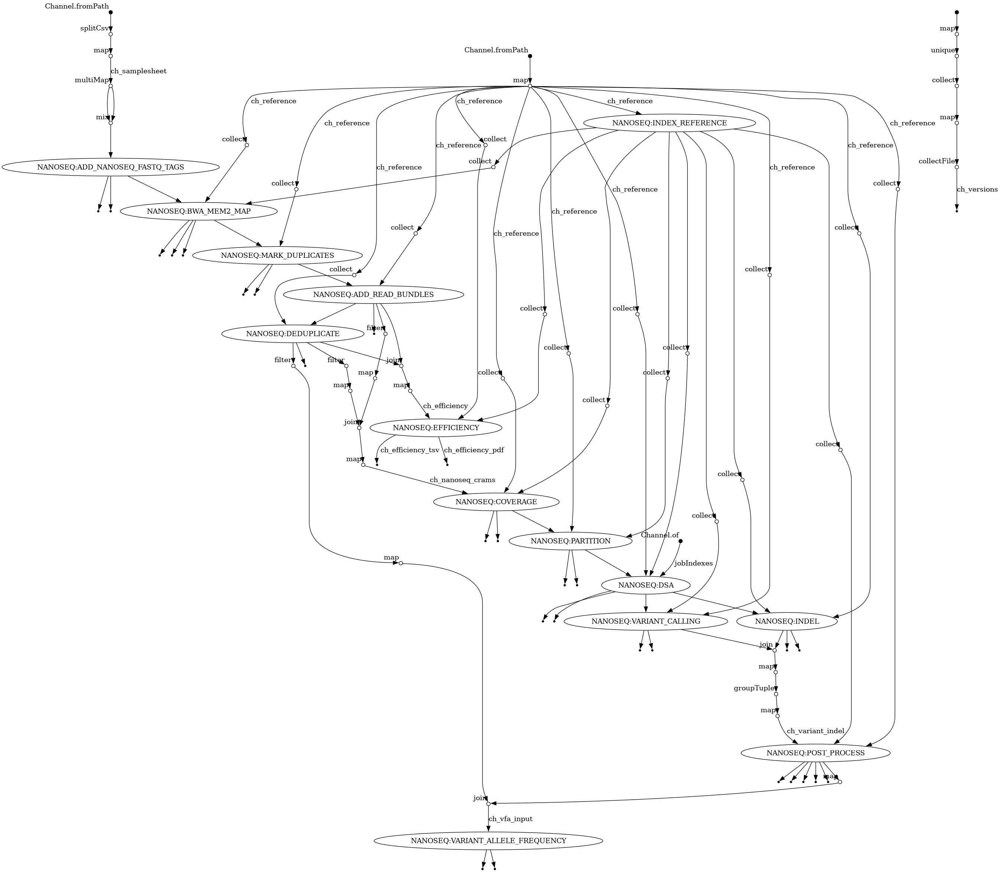

[](https://pixi.sh)


# NanoSeq

>[!NOTE]
>`NBISweden/NanoSeq` was forked and subsequently detached from `fa8sanger/NanoSeq` ([commit 31e34bf](https://github.com/fa8sanger/NanoSeq/tree/31e34bf5dc30165e2ae28c027f6aead3a8970410)), itself a fork of the [original NanoSeq project](https://github.com/cancerit/NanoSeq).<br><br>
>The original workflow codebase was released under the GNU AFFERO GENERAL PUBLIC LICENSE, as is this modified version.<br><br>
>Credit for the original work goes solely to the NanoSeq authors.<br><br>
>Modifications are summarised in `CHANGELOG.md`.<br><br>
>To clearly separate this and the original NanoSeq project, versioning starts over from major release 1, with the NBIS suffix added (i.e.: 1.0.0-NBIS).

>[!WARNING]
>`NBISweden/NanoSeq` is not to be confused with `nf-core/nanoseq`, an unrelated workflow for nanopore data analysis.

## Description

Nanorate sequencing (NanoSeq) is a DNA library preparation and sequencing protocol based on Duplex Sequencing ([Schmitt et al, 2012](https://doi.org/10.1073/pnas.1208715109)) and BotSeqS ([Hoang et al, 2016](https://doi.org/10.1073/pnas.1607794113)). NanoSeq allows calling mutations with single molecule resolution and extremely low error rates ([Abascal et al, 2021](https://doi.org/10.1038/s41586-021-03477-4)). The workflow code in this repository covers preprocessing of NanoSeq sequencing data, assessment of data quality/efficiency, calling of mutations (substitutions and indels), and the estimation of mutation burdens and substitution profiles. The wet-lab protocol is described in the original publication ([Abascal et al, 2021](https://doi.org/10.1038/s41586-021-03477-4)) and on ProtocolExchange ([Lensing et al, 2021](https://protocolexchange.researchsquare.com/article/pex-1298/v1)).

## Quick start

1. Clone the workflow repository: `git clone https://github.com/NBISweden/NanoSeq.git`
2. [Install Pixi](https://pixi.sh/latest/installation/): `curl -fsSL https://pixi.sh/install.sh | sh`
3. In the cloned repo, run `pixi install`
4. Run the workflow test: `pixi run test`

#### Optional: cloud development environment for testing

[](https://codespaces.new/NBISweden/NanoSeq)

### Running Nextflow commands

- NanoSeq can be run if `Nextflow` + `Apptainer` are available in `$PATH`
- Using the provided `pixi` environment handles these dependencies automatically. To use the environment, prepend normal Nextflow commands with `pixi run`.
- Available command line parameters are listed with `nextflow main.nf --help` (i.e. `pixi run nextflow main.nf --help`)
- A typical command with default settings looks like this:

```
pixi run nextflow main.nf -profile standard,apptainer --samplesheet data/test/samplesheet.csv --fasta data/test/genome.fa
```

## Required input files

NanoSeq takes a reference genome in FASTA format, and reads in FASTQ format. Read paths are specified in a sample sheet CSV file with the following columns:

| id            | normal_method | duplex_1                      | duplex_2                      | normal_1                      | normal_2                      |
|---------------|---------------|-------------------------------|-------------------------------|-------------------------------|-------------------------------|
| sample1       | duplex        | ./data/test/duplex.R1.fastq.gz| ./data/test/duplex.R2.fastq.gz| ./data/test/normal.R1.fastq.gz| ./data/test/normal.R2.fastq.gz|

- `normal_method`: was the normal sample sequenced with the NanoSeq protocol or conventionally? Options are `duplex` or `standard`.

## Workflow overview

The workflow performs preprocessing & NanoSeq analysis of duplex sequencing data, see the image below for the process overview.




### Preprocessing

1) `ADD_NANOSEQ_FASTQ_TAGS`: trims duplex barcodes from the fastq files and adds them to the fastq header of each read (rb, mb tags)
2) `BWA_MEM2_MAP`: maps reads to the reference genome using `bwa` with option `-C to add the barcodes as tags in the bam
3) `MARK_DUPLICATES`: mark optical duplicates, add rc & mc tags
4) `ADD_READ_BUNDLES`: filters optical duplicates, unpaired mates, and creates the RB tag (RB:rc,mc,rb,mb) for read bundles
5) `DEDUPLICATE`: removes PCR duplicates, keeps one read-pair per read bundle to produce a 'neat' matched normal file (to distinguish somatic mutations from germline SNPs)
6) `EFFICIENCY`: outputs information on the efficiency of the NanoSeq experiment, including duplicate rates amd read counts

	>Theoretically, the optimal duplicate rate (duplex bases / sequenced bases) is 81% for read bundles of size >= 2+2, with 65% and 90% yielding ≥80% at maximum efficiency. Empirically the optimal duplicate rate is 75-76%. Apart from the duplicate rate, the following outputs are important to assess the quality of the experiment: F-EFF or strand drop out fraction: shows the fraction of read bundles missing one of the two original strands, beyond what would be expected under random sampling (assuming a binomial process). Good values are between 0.10-0.30, and larger values are likely due to DNA damage, such as modified bases or internal nicks preventing amplification of one of the two strands. Larger values do not impact the quality of the results, just reduce the efficiency of the protocol. EFFICIENCY: This is the number of duplex bases divided by the number of sequenced bases. Maximum efficiency is ~0.07 when duplicate rates and strand drop out are optimal. GC_BOTH and GC_SINGLE: the GC content of RBs with both strands and with just one strand. The two values should be similar to each other and the genome average. If there are large deviations it may be due to biases in PCR amplification. If GC_BOTH is substantially larger than GC_SINGLE, DNA denaturation before dilution may have taken place.

### NanoSeq analysis

1) `COVERAGE`: coverage histogram is computed for the bulk BAM files
2) `PARTITION`: divides coverage into roughly equal workloads for subsequent steps, to be split across the value of `--jobs`
3) `DSA`: compute DSA bed files. Optionally provide SNP and noise beds to be masked from the output VCF file

>Masks for GRCh37 and GRCh38 are available [here](https://drive.google.com/drive/folders/1wqkgpRTuf4EUhqCGSLA4fIg9qEEw3ZcL?usp=sharing). "RE" versions include the TGCA restriction site. "RE" and "WGS" versions include sites found to be prone to artifacts in NovaSeqX.

4) `VARIANT_CALLING` & `INDEL`: compute variants and indels
5) `POST_PROCESS`: merges results and produces summaries
6) `VARIANT_ALLELE_FREQUENCY`: computes the variant allele frequency (VAF) for each sample

## Outputs


TODO: fix below


The most relevant summary files include the following.

* `muts.vcf.gz / muts.tsv`: substitutions called in vcf and tsv format. "PASS" substitutions are those not filtered by the common SNP and noisy sites masks (see Genomic masks).
* `indels.vcf.gz`: indel calls
* `burden.masked-vs-unmasked.pdf`: estimated burden before and after filtering common SNPs. Provides a qualitative view on contamination.
* `mut_burden.tsv`: estimated substitution burden with Poisson confidence intervals. The corrected burden shows the burden after normalizing observed trinucleotide frequencies to the genomic trinucleotide frequencies.
* `trinuc-profiles.pdf / trint_subs_obs_corrected.tsv / trint_counts_and_ratio2genome.tsv`: Trinucleotide substitution profiles (observed and corrected), using the trinucleotide substitution counts in `trint_subs_obs_corrected.tsv` and the normalization of trinucleotide frequencies in `trint_counts_and_ratio2genome.tsv`. Normalization is required because NanoSeq results are depleted of trinucleotides overlapping the restriction site and of CpGs due to extensive filtering of common SNPs.
* `cov.bed.gz`: large file containing the effective duplex coverage for each genomic site, also showing the trinucleotide context of each site. This file is required to to calculate burdens and substitution profiles in sets of specific genomic regions (e.g. highly expressed genes, heterochromatin, ...).
* `subst_asym.pdf / subst_asym_and_rates_binned.pdf / subst_asym_binned.tsv / subst_asym.pvals / subst_asym.tsv`: These files are not generally needed for NanoSeq analysis. They were originally used to detect asymmetries in the original DuplexSeq & BotSeqS protocols. 
* `mismatches.trinuc-profile.pdf / mismatches.subst_asym.pdf / mismatches.subst_asym.pvals / mismatches.subst_asym.tsv`: These files show the asymmetries and pyrimidine/purine-based trinucleotide substitution profiles for single-strand consensus calls. These profiles are useful to understand DNA damage during library preparation.
* `DSC_errors_per_channel.pdf / DSC_estimated_error_rates.pdf / estimated_error_rates.tsv / SSC-mismatches-Both.triprofiles.tsv / SSC-mismatches-Purine.triprofiles.tsv / SSC-mismatches-Pyrimidine.triprofiles.tsv`: Based on the independent error rates in the purine and pyrimidine channels (e.g. G>T and C>A), we calculate the probability of having independent errors affecting both strands and resulting in double-strand consensus.
